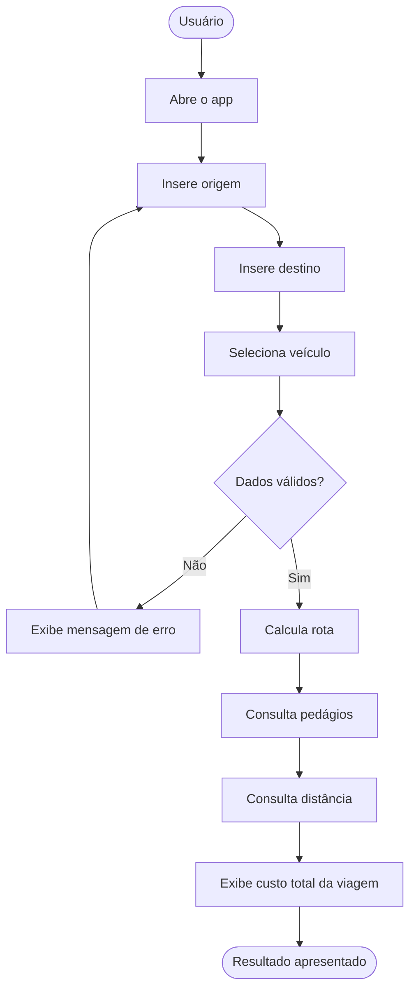
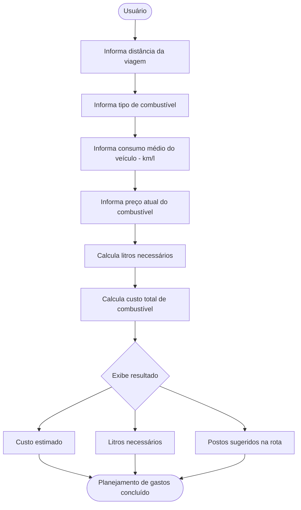
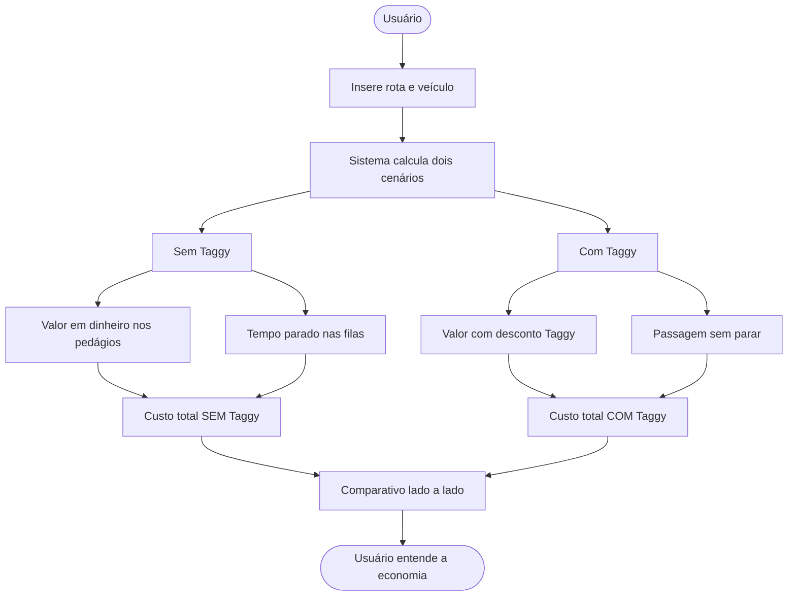
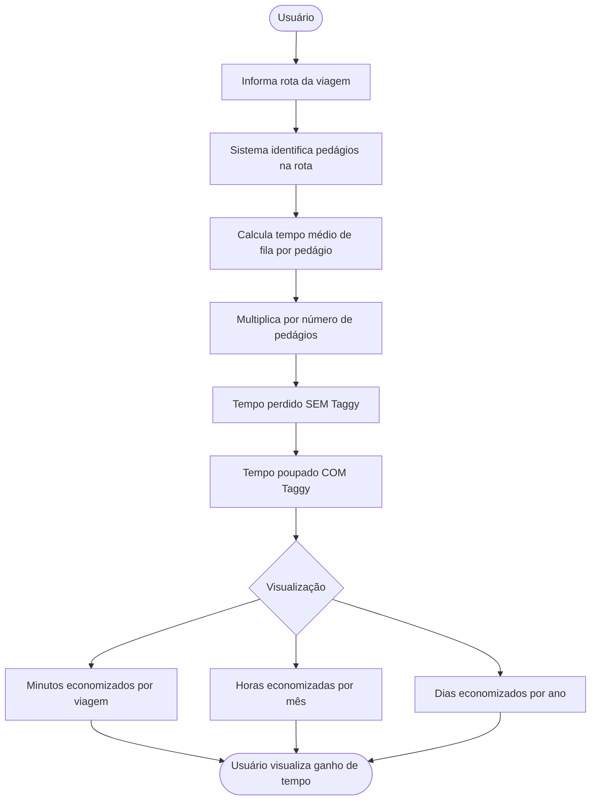
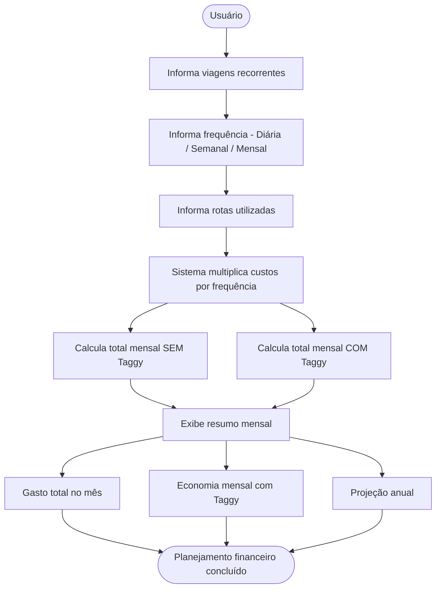
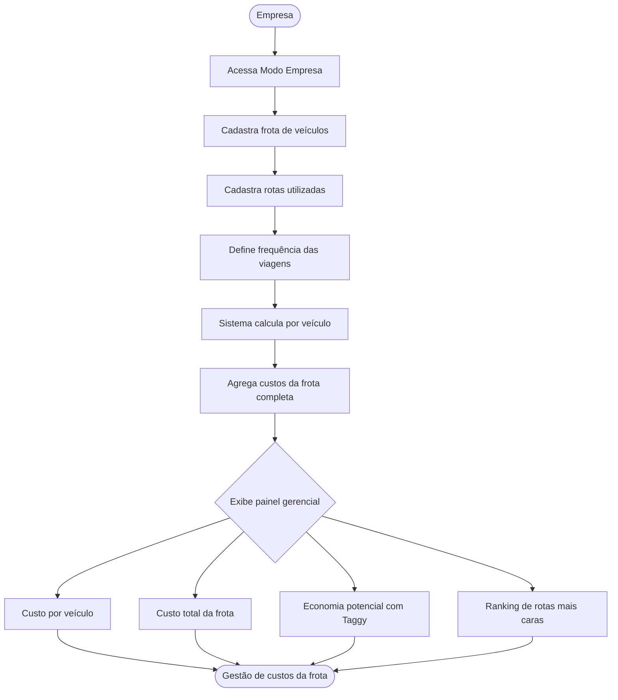
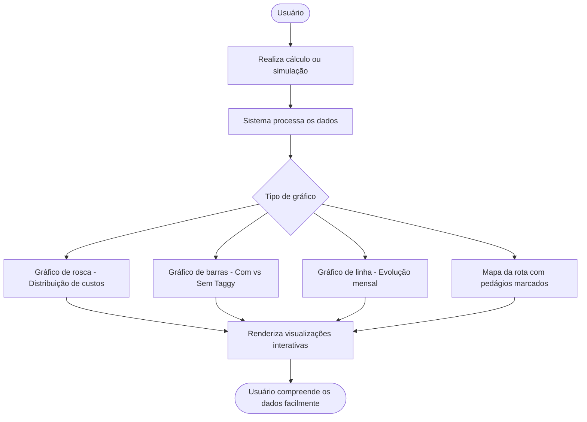
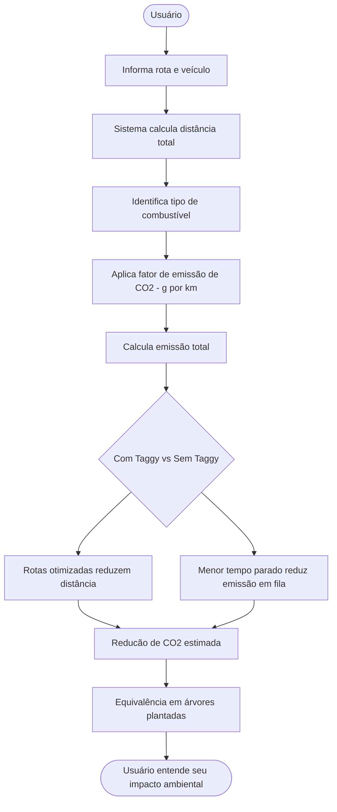
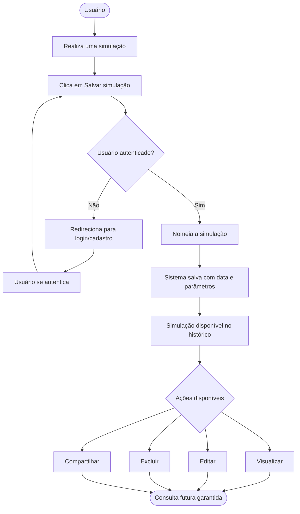
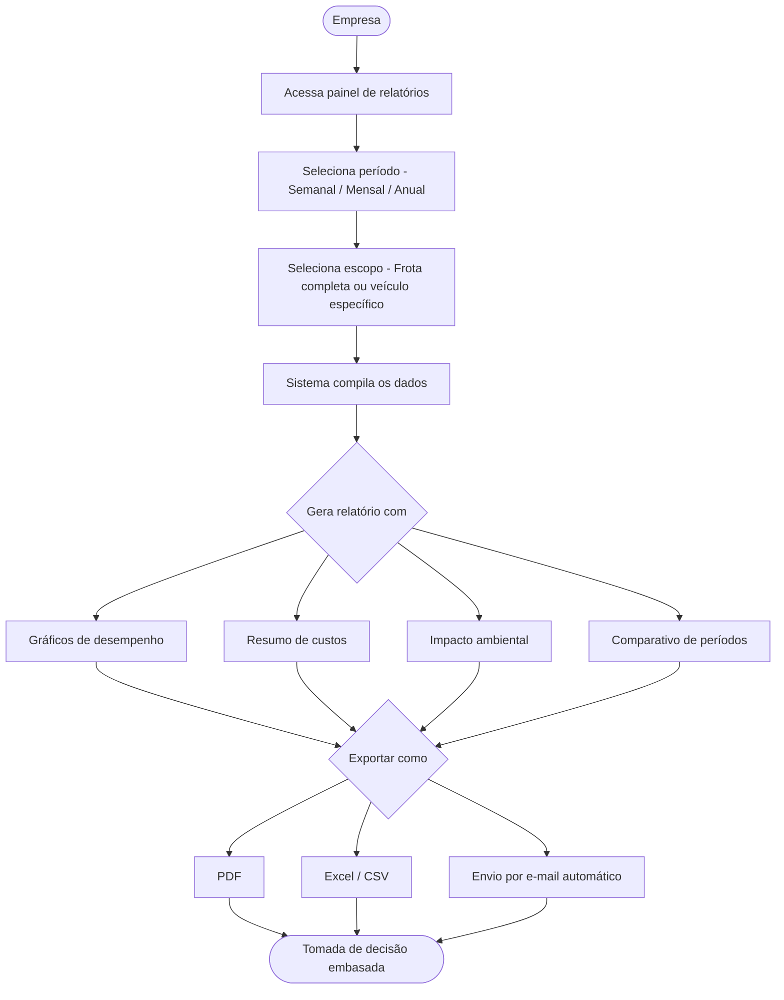

# CARBON-DEFUSE

## 📌 Ideia da Aplicação

**Nome:** Carbon Defuse 🌱🚗
Uma calculadora inteligente inspirada na Taggy que simula custos de viagens, economia financeira e impacto ambiental ao utilizar pedágios e estacionamentos eletrônicos.

---

## 🎯 Objetivo

Ajudar usuários e empresas a visualizar, de forma clara e interativa, os benefícios econômicos e ambientais do uso de soluções automáticas como a Taggy.

---

## 👥 Papéis da Equipe

* **Dev Back end:** Gabriel Lucas Soares da Silva
* **Product Owner:** Lucas Rogério Moura Brito
* **Dev Front End:** Jailson de Souza Jr
* **Designer:** Gabriel Dias Mendonça de Melo
* **Scrum Master:** Felipe Ulisses Cavalcanti de Albuquerque
* **QA:** Lucas Nery Sereno

---
             
             ## 📖 Histórias de Usuário 
             
             ### 🚗 1. Calcular viagem
             
             Como usuário, quero inserir origem, destino e veículo para calcular custo da viagem.
             
             ### ⛽ 2. Estimar combustível
             
             Como usuário, quero ver o custo estimado de combustível para planejar gastos.
             
             ### 💳 3. Comparar com/sem Taggy
             
             Como usuário, quero comparar custos para entender a economia.
             
             ### ⏱️ 4. Economia de tempo
             
             Como usuário, quero visualizar tempo economizado em pedágios.
             
             ### 📅 5. Simulação mensal
             
             Como usuário, quero simular meus gastos mensais com viagens.
             
             ### 🏢 6. Modo empresa
             
             Como empresa, quero inserir frota e rotas para calcular custos totais.
             
             ### 📊 7. Visualização gráfica
             
             Como usuário, quero ver gráficos para entender os dados facilmente.
             
             ### 🌱 8. Impacto ambiental
             
             Como usuário, quero ver redução de CO₂ para entender impacto ambiental.
             
             ### 💾 9. Salvar simulações
             
             Como usuário, quero salvar cálculos para consultar depois.
             
             ### 📄 10. Relatórios automáticos
             
             Como empresa, quero gerar relatórios para tomada de decisão.

---

## ✅ 3Cs das Histórias

* **Card:** Histórias descritas acima
* **Conversation:** Refinamento contínuo com o time
* **Confirmation:** Critérios de aceitação definidos para validar funcionalidades

---

## 📊 Priorização das Entregas

### 🔥 Alta Prioridade

* Calcular viagem
* Comparação com/sem Taggy
* Cadastro/Login

### ⚡ Média Prioridade

* Simulação mensal
* Modo empresa
* Impacto ambiental

### 🧊 Baixa Prioridade

* Gráficos
* Relatórios automáticos
* Salvamento de simulações

---

## 🧠 Funcionalidades Baseadas no Brainwriting

### 1. Calculadora de despesas de viagem

Usuário informa origem, destino e veículo.
Sistema calcula pedágios, combustível e custo total.

### 2. Comparação Taggy vs tradicional

Exibe diferença de custos e tempo.

### 3. Simulador mensal

Calcula gastos e economia com base em frequência de viagens.

### 4. Modo corporativo

Analisa frotas e rotas médias.

### 5. Visualização gráfica

Exibe gráficos de custos e economia.

### 6. Impacto ambiental

Mostra redução de CO₂ e uso de papel.

---

## 🔮 Possíveis Desdobramentos

* Simulação de cenários futuros
* Comparação de rotas
* Estimativa anual de custos
* Histórico de cálculos
* Relatórios empresariais avançados

---

## 🛠️ Tecnologias
* Java
* Spring Boot
* Spring Data JPA
* Spring Security
* MySQL
* Docker
* HTML/CSS/JS

---

## 🧩 Estrutura do Projeto
```
project/
 ├── src/
 │   ├── main/
 │   │   ├── java/com/project/
 │   │   │   ├── trips/
 │   │   │   ├── users/
 │   │   │   ├── analytics/
 │   │   │   ├── core/
 │   │   │   └── ProjectApplication.java
 │   │   └── resources/
 │   │       ├── templates/
 │   │       ├── static/
 │   │       └── application.properties
 │   └── test/
 ├── pom.xml
```


---


### 📋 Backlog (Trello)

Adicione aqui o print do backlog:
[
https://app.clickup.com/90171098067/v/dc/2kz9vgyk-677
---

## 📌 Quadro Kanban

Adicione aqui o print do quadro:

https://app.clickup.com/90171098067/v/b/2kz9vgyk-717

---

#protótipos Lofi das Histórias de Usuário 

https://ignite-opera-61434632.figma.site/

#Screencast: https://drive.google.com/file/d/1P_Wi3_xW9Hr4-8Oe3ZbyY9el_fQXwVpF/view?usp=drivesdk

# Diagramas das Histórias de Usuário

```

---
```
## 1. calcular viagem



---

## 2. Estimar Combustível



---

## 3. Comparar Com / Sem Taggy



---

## 4. Economia de Tempo



---

## 5. Simulação Mensal



---

## 6. Modo Empresa



---

## 7. Visualização Gráfica



---

## 8. Impacto Ambiental



---

## 9. Salvar Simulações



---

## 10. Relatórios Automáticos


