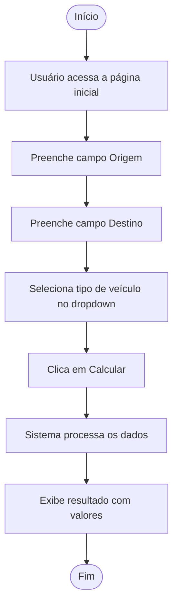
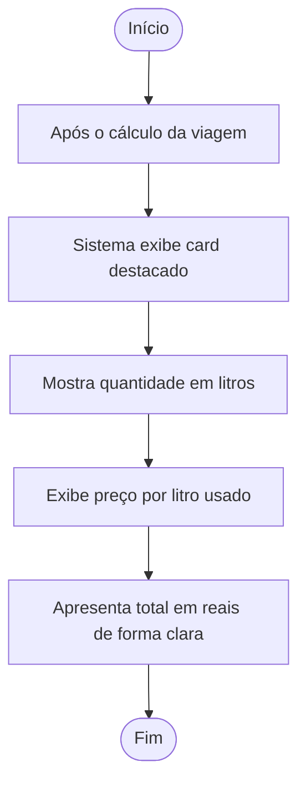
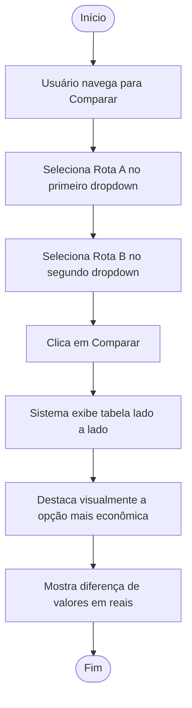
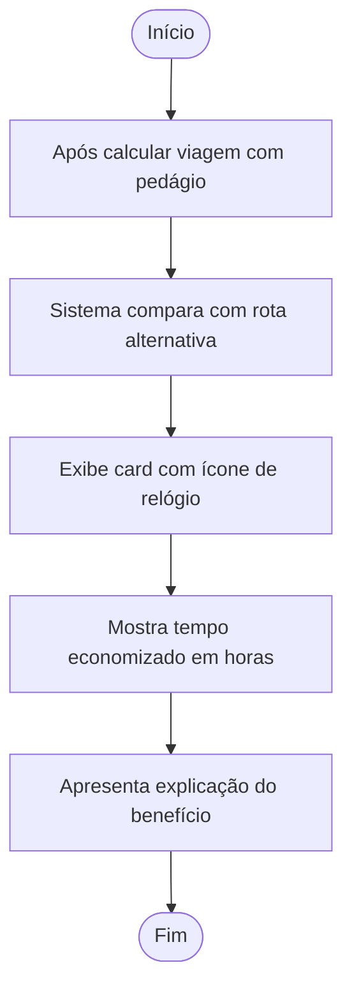
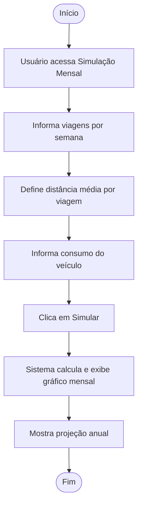
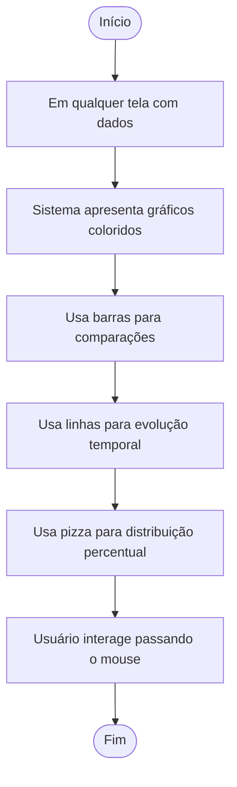
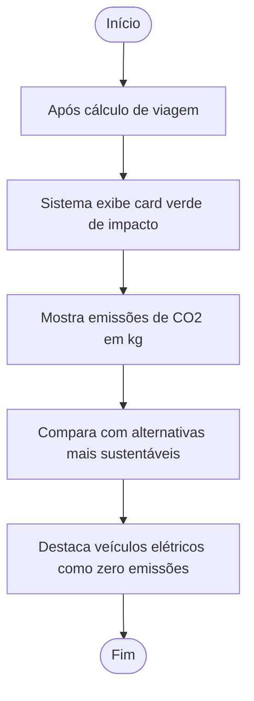
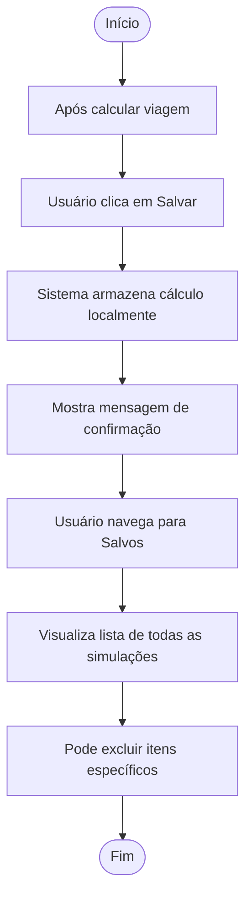
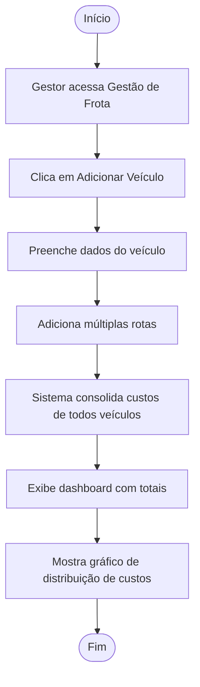
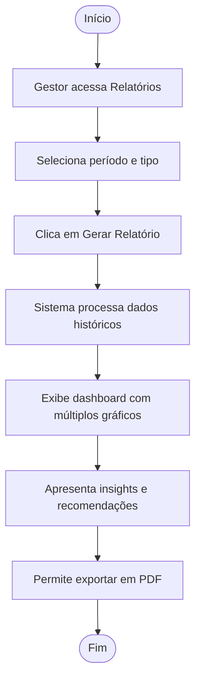

# CARBON-DEFUSE

## 📌 Ideia da Aplicação

**Nome:** Carbon Defuse 🌱🚗
Uma calculadora inteligente inspirada na Taggy que simula custos de viagens, economia financeira e impacto ambiental ao utilizar pedágios e estacionamentos eletrônicos.

---

## 🎯 Objetivo

Ajudar usuários e empresas a visualizar, de forma clara e interativa, os benefícios econômicos e ambientais do uso de soluções automáticas como a Taggy.

---

## 👥 Papéis da Equipe

* **Dev Back end:** Gabriel Lucas Soares da Silva
* **Product Owner:** Lucas Nery Sereno
* **Dev Front End:** Lucas Rogério Moura Brito
* **Designer:** Gabriel Dias Mendonça de Melo
* **Screw Master:** Felipe Ulisses Cavalcanti de Albuquerque
* **QA:** Jailson de Souza Junior

---

## 📖 Histórias de Usuário 

### 🚗 1. Calcular viagem

Como usuário, quero inserir origem, destino e veículo para calcular custo da viagem.

### ⛽ 2. Estimar combustível

Como usuário, quero ver o custo estimado de combustível para planejar gastos.

### 💳 3. Comparar com/sem Taggy

Como usuário, quero comparar custos para entender a economia.

### ⏱️ 4. Economia de tempo

Como usuário, quero visualizar tempo economizado em pedágios.

### 📅 5. Simulação mensal

Como usuário, quero simular meus gastos mensais com viagens.

### 🏢 6. Modo empresa

Como empresa, quero inserir frota e rotas para calcular custos totais.

### 📊 7. Visualização gráfica

Como usuário, quero ver gráficos para entender os dados facilmente.

### 🌱 8. Impacto ambiental

Como usuário, quero ver redução de CO₂ para entender impacto ambiental.

### 💾 9. Salvar simulações

Como usuário, quero salvar cálculos para consultar depois.

### 📄 10. Relatórios automáticos

Como empresa, quero gerar relatórios para tomada de decisão.

---

## ✅ 3Cs das Histórias

* **Card:** Histórias descritas acima
* **Conversation:** Refinamento contínuo com o time
* **Confirmation:** Critérios de aceitação definidos para validar funcionalidades

---

## 📊 Priorização das Entregas

### 🔥 Alta Prioridade

* Calcular viagem
* Comparação com/sem Taggy
* Cadastro/Login

### ⚡ Média Prioridade

* Simulação mensal
* Modo empresa
* Impacto ambiental

### 🧊 Baixa Prioridade

* Gráficos
* Relatórios automáticos
* Salvamento de simulações

---

## 🧠 Funcionalidades Baseadas no Brainwriting

### 1. Calculadora de despesas de viagem

Usuário informa origem, destino e veículo.
Sistema calcula pedágios, combustível e custo total.

### 2. Comparação Taggy vs tradicional

Exibe diferença de custos e tempo.

### 3. Simulador mensal

Calcula gastos e economia com base em frequência de viagens.

### 4. Modo corporativo

Analisa frotas e rotas médias.

### 5. Visualização gráfica

Exibe gráficos de custos e economia.

### 6. Impacto ambiental

Mostra redução de CO₂ e uso de papel.

---

## 🔮 Possíveis Desdobramentos

* Simulação de cenários futuros
* Comparação de rotas
* Estimativa anual de custos
* Histórico de cálculos
* Relatórios empresariais avançados

---

## 🛠️ Tecnologias

* Python
* Django
* Django REST Framework
* PostgreSQL
* Docker
* HTML/CSS/JS

---

## 🧩 Estrutura do Projeto

```
project/
 ├── trips/
 ├── users/
 ├── analytics/
 ├── core/
 ├── templates/
 ├── static/
 ├── manage.py
```

---

## 📋 Backlog (Trello)

Adicione aqui o print do backlog:
[
[](https://trello.com/invite/b/69c1bde657f53fe31d811741/ATTI282f55e340e0a2bb43f12305ee7197d7321288D9/carbon-defuse)
](https://trello.com/b/9rcdpxLn)
---

## 📌 Quadro Kanban

Adicione aqui o print do quadro:


---

## ▶️ Como Executar o Projeto

### 1. Clonar repositório

```
git clone <repo>
```

### 2. Criar ambiente virtual

```
python -m venv venv
```

### 3. Ativar ambiente

```
venv\\Scripts\\activate
```

### 4. Instalar dependências

```
pip install -r requirements.txt
```

### 5. Rodar migrações

```
python manage.py migrate
```

### 6. Executar servidor

```
python manage.py runserver
```

---

## 🧪 Testes

Executar testes com:

# 🚀 Projeto Web com Django

## 📌 Ideia da Aplicação

**Nome:** Carbon Defuse 🌱🚗
Uma calculadora inteligente inspirada na Taggy que simula custos de viagens, economia financeira e impacto ambiental ao utilizar pedágios e estacionamentos eletrônicos.

---

## 🎯 Objetivo

Ajudar usuários e empresas a visualizar, de forma clara e interativa, os benefícios econômicos e ambientais do uso de soluções automáticas como a Taggy.

---

## 👥 Papéis da Equipe

* **Dev Fullstack:** Gabriel Lucas Soares da Silva
* **Product Owner (P.O):** Lucas Nery Sereno
* **Dev Back-End:** Integrante 2
* **Dev Front-End:** Integrante 3
* **Scrum Master:** Integrante 4
* **QA:** Integrante 5

---

## 📖 Histórias de Usuário 

### 🚗 1. Calcular viagem

Como usuário, quero inserir origem, destino e veículo para calcular custo da viagem.

### ⛽ 2. Estimar combustível

Como usuário, quero ver o custo estimado de combustível para planejar gastos.

### 💳 3. Comparar com/sem Taggy

Como usuário, quero comparar custos para entender a economia.

### ⏱️ 4. Economia de tempo

Como usuário, quero visualizar tempo economizado em pedágios.

### 📅 5. Simulação mensal

Como usuário, quero simular meus gastos mensais com viagens.

### 🏢 6. Modo empresa

Como empresa, quero inserir frota e rotas para calcular custos totais.

### 📊 7. Visualização gráfica

Como usuário, quero ver gráficos para entender os dados facilmente.

### 🌱 8. Impacto ambiental

Como usuário, quero ver redução de CO₂ para entender impacto ambiental.

### 💾 9. Salvar simulações

Como usuário, quero salvar cálculos para consultar depois.

### 📄 10. Relatórios automáticos

Como empresa, quero gerar relatórios para tomada de decisão.

---

## ✅ 3Cs das Histórias

* **Card:** Histórias descritas acima
* **Conversation:** Refinamento contínuo com o time
* **Confirmation:** Critérios de aceitação definidos para validar funcionalidades

---
## Sketches e StoryBoards das Histórias de Usuário: 
https://ignite-opera-61434632.figma.site/

## 📊 Priorização das Entregas

### 🔥 Alta Prioridade

* Calcular viagem
* Comparação com/sem Taggy
* Cadastro/Login

### ⚡ Média Prioridade

* Simulação mensal
* Modo empresa
* Impacto ambiental

### 🧊 Baixa Prioridade

* Gráficos
* Relatórios automáticos
* Salvamento de simulações

---

## 🧠 Funcionalidades Baseadas no Brainwriting

### 1. Calculadora de despesas de viagem

Usuário informa origem, destino e veículo.
Sistema calcula pedágios, combustível e custo total.

### 2. Comparação Taggy vs tradicional

Exibe diferença de custos e tempo.

### 3. Simulador mensal

Calcula gastos e economia com base em frequência de viagens.

### 4. Modo corporativo

Analisa frotas e rotas médias.

### 5. Visualização gráfica

Exibe gráficos de custos e economia.

### 6. Impacto ambiental

Mostra redução de CO₂ e uso de papel.

---

## 🔮 Possíveis Desdobramentos

* Simulação de cenários futuros
* Comparação de rotas
* Estimativa anual de custos
* Histórico de cálculos
* Relatórios empresariais avançados

---

## 🛠️ Tecnologias

* Python
* Django
* Django REST Framework
* PostgreSQL
* Docker
* HTML/CSS/JS

---

## 🧩 Estrutura do Projeto

```
project/
 ├── trips/
 ├── users/
 ├── analytics/
 ├── core/
 ├── templates/
 ├── static/
 ├── manage.py
```

---

## 📋 Backlog (Trello)

Adicione aqui o print do backlog:


---

## 📌 Quadro Kanban

Adicione aqui o print do quadro:


---

## ▶️ Como Executar o Projeto

### 1. Clonar repositório

```
git clone <repo>
```

### 2. Criar ambiente virtual

```
python -m venv venv
```

### 3. Ativar ambiente

```
venv\\Scripts\\activate
```

### 4. Instalar dependências

```
pip install -r requirements.txt
```

### 5. Rodar migrações

```
python manage.py migrate
```

### 6. Executar servidor

```
python manage.py runserver
```

---

## 🧪 Testes

Executar testes com:

```
python manage.py test
```

---

## 📦 Entrega de Valor

O sistema permite:

* Redução de custos com transporte
* Visualização clara de economia
* Consciência ambiental
* Apoio à tomada de decisão empresarial

---

## 💡 Princípio das Criações

"Na dinâmica de Brainwriting, surgiram propostas voltadas para ampliar as funcionalidades de uma calculadora de custos e impactos ambientais da Taggy."

As ideias evoluem a calculadora para uma ferramenta estratégica, combinando análise financeira com sustentabilidade.

---

## 🏁 Conclusão

Projeto altamente relevante para portfólio, unindo lógica de negócio, dados, sustentabilidade e experiência do usuário.
---

## ⚙️ Diagramas de Atividades do Sistema

Abaixo estão os diagramas de atividades (UML) correspondentes a cada história de usuário, detalhando o fluxo exato de interação do sistema com base nos storyboards.

### 👤 Usuário Final (B2C)

#### 1. Calcular Custo da Viagem


#### 2. Ver Custo Estimado de Combustível


#### 3. Comparar Custos


#### 4. Visualizar Tempo Economizado


#### 5. Simular Gastos Mensais


#### 6. Visualização Gráfica


#### 7. Ver Impacto Ambiental


#### 8. Salvar Simulações


---

### 🏢 Empresa / Gestão de Frota (B2B/ESG)

#### 9. Calcular Custos de Frota


#### 10. Gerar Relatórios Automáticos

